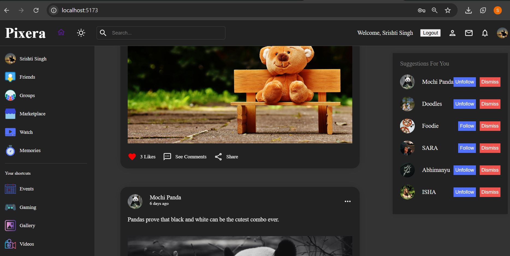

# 🌐 PIXERA - Social Media Web App
   Where your new era of sharing starts.Just a create,connect,scroll,repeat.
  

**Pixera** is a modern, responsive, and full-featured social media web application built using the **MERN Stack (React, Node.js, Express, MySQL)** with SCSS styling. It enables users to create an account, update profiles, share posts, follow/unfollow others, like and comment on posts, switch to dark mode, and explore other profiles.
---

## 🚀 Live Demo

🔗 [Pixera Frontend Live Preview](https://pixera-frontend.vercel.app/)

🔗 [Pixera Backend Live Preview](Deploy is in progress with mysql database)

---

## 🛠️ Tech Stack

### 💻 Frontend
- **React JS**
- **SCSS** (modular and responsive styling)
- **React Router**
- **Axios**
- **Context API** (for Auth and Theme management)

### 🔧 Backend
- **Node.js**
- **Express.js**
- **JWT Authentication**
- **Bcrypt.js** (password hashing)

### 🗃️ Database
- **MySQL**
- **MySQL Workbench**
- **Sequelize / Raw Queries**

---

## ✨ Features

- 🔐 **Authentication**: Secure Login & Register using JWT.
- 🧑‍💼 **Profile Management**: Update profile info and profile/cover images.
- ➕ **Post Features**: Like, comment,share own posts ,delete own posts and view posts in a clean UI.
- 🔎 **Search**: Search for other users by username.
- 🌙 **Dark Mode**: Smooth dark/light theme toggle.
- 👥 **Follow/Unfollow**: Follow or unfollow other users.
- 🔁 **Real-Time Updates**: Auto UI update after actions.
- 🧭 **Navigation**: Intuitive routing across profile,see others profile, feed.
- 📱 **Responsive UI**: Works well on desktop, tablet, and mobile screens.
- 🌸✨Adding stories and can see others stories with time and name.

---

## 📸 Screenshots

### 🔐 Login Page  

### 🆕 Register Page  

### 🏡 Home Feed  

### 🙍‍♀️ User Profile  

### 📝 Like and Comment  

### 👥 Friends Profile  

### 🧾 Posts  

### 📚 Stories  

---

## 📂 Folder Structure

